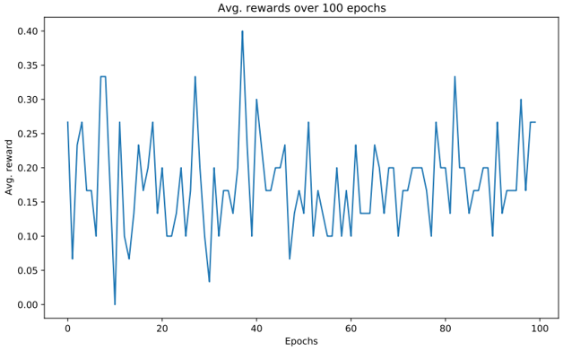
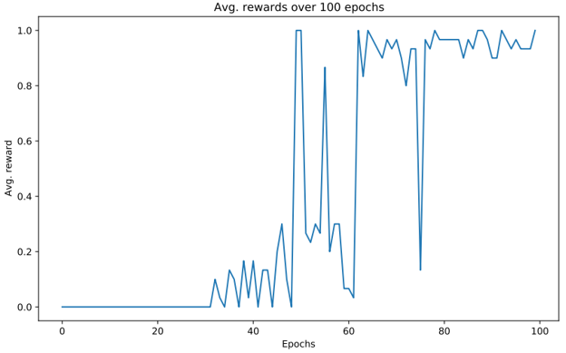

# Deep Q-learning for Playing Parser-based Text-based Games
In this project, I use deep reinforcemnt learning to train an intelligent RL agent to play parser-based text-based games.

I specifically leverage and implement ideas from the following two papers:
1. [Language Understanding for Text-based Games Using Deep Reinforcement Learning](https://arxiv.org/abs/1506.08941)
2. [Counting to Explore and Generalize in Text-based Games](https://arxiv.org/abs/1806.11525)

Before discussion the results and other nitty-gritty details about the project, I would like to briefly describe text-based games in general so that we are all up-to-date:

## Text-based Games
In text-based games, a player has to issue a series of text commands to win a game. At every stage/level of the game, the player receives a description of the current state of the game and has to issue an appropriate command based on the description. The player moves to the next level and receives a reward (depending on the specific game) if it issues a correct command. The player eins the game if it can successfully complete the primary objective (specified at the start of the game) withing the specified number of steps.

There are 3 types of text-based games:
1. Parser-based games: The player issues command by generating a sequence of tokens.
2. Choice-based games: The player issues commands by choosing from a given list.
3. Hypertext-based games: The player issues commands by pointing to the words in the state description.

In this project, we will play a parser-based game: The Coin Collector game available in the [Textworld Learning Environment](https://arxiv.org/abs/1806.11532))

### The Coin Collector Game
**Objective:** The objective of the game is to collect a coin. The player starts at some random room in every episode. It has to then navigate through the different rooms and finally retrieve the coin. The player gets a score of 1 on collecting the game. For all other steps, no score is given. At every step of the game, the player issues a command and based on it, the state of the game changes. The command is of the form \[VERB, NOUN\]. E.g., some example commands are “go north”, “take coin”, etc.

**Levels:** *Level* refers to optimal trajectory’s length of the game. E.g., L5 means a optimal trajectory has 5 rooms.

**Mode:** There are 3 modes dependding on the difficulty-
- *Easy*- A map with no distractor rooms.
- *Medium*- A map with 1 distractor room added at random.
- *Hard*- A map with 2 distractor rooms added at random.

In this project, we play Level 5 games of Easy and Medium difficulties.

## Training an RL-agent to Play the Coin Collector Game
We train an RL-agent based on the LSTM-DQN architecture proposed by [Narsimhan et al., 2015](https://arxiv.org/abs/1506.08941). Additionally, we also leverage the discovery bonus strategies (*Cumulative Counting Bonus*, *Episodic Discovery Bonus*) discussed in [Yuan et al., 2018](https://arxiv.org/abs/1806.11525) to improve the promote training-stage exploration. This should ideally help the RL-agent to quickly converge to the optimal winning policy by efficientl exploration of the state space.

Specifically, we try out the following expriments-
1. Playing a L5 Easy game with Random agent (baseline), Vanilla LSTM-DQN (DQN+), LSTM-DQN with Cumulative Discovery Bonus (DQN+), LSTM-DQN with Episodic Discovery Bonus (DQN++).
2. Transfer learning experiments: Training a pre-trained RL-agent on an unseen L5 Easy game and comparing the performance against a completely new Rl-agent on the same game.

### Results
Here are some of the results of different experiments:

#### Performance in L5 Easy game
In the following figures, the performance is represented in terms of the average reward the respective Agent achieves in 100 epochs of the game.

**Random Agent**

**LSTM-DQN Agent**

**LSTM-DQN Agent with Cumulative Counting Bonus**

**LSTM_DQN with Episodic Discovery Bonus**

#### Transfer Learning Experiment Results
**LSTM-DQN Agent**

**LSTM-DQN Agent with Cumulative Counting Bonus**

**LSTM_DQN with Wpisodic Discovery Bonus**

